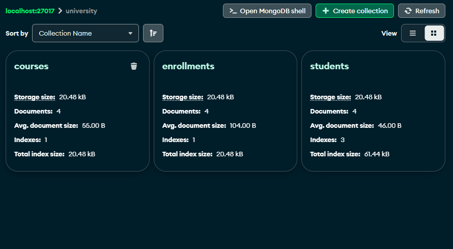
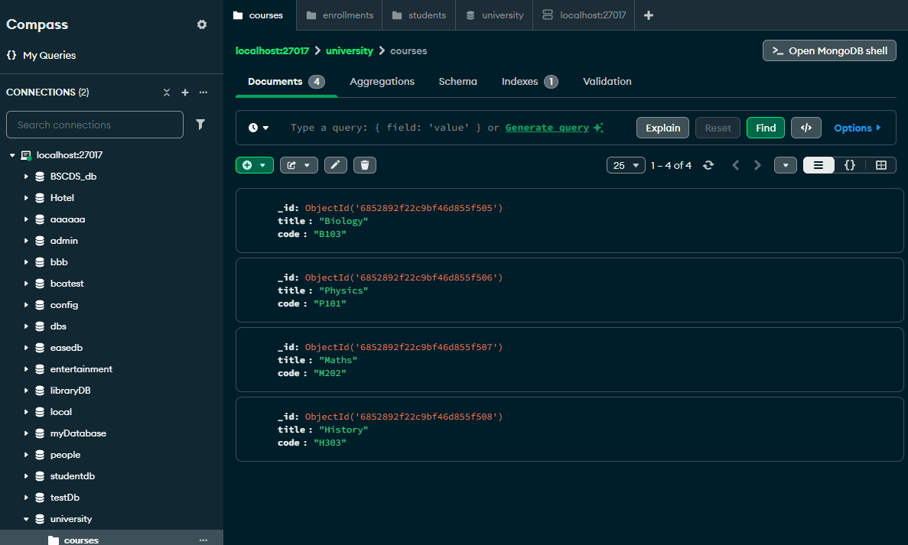
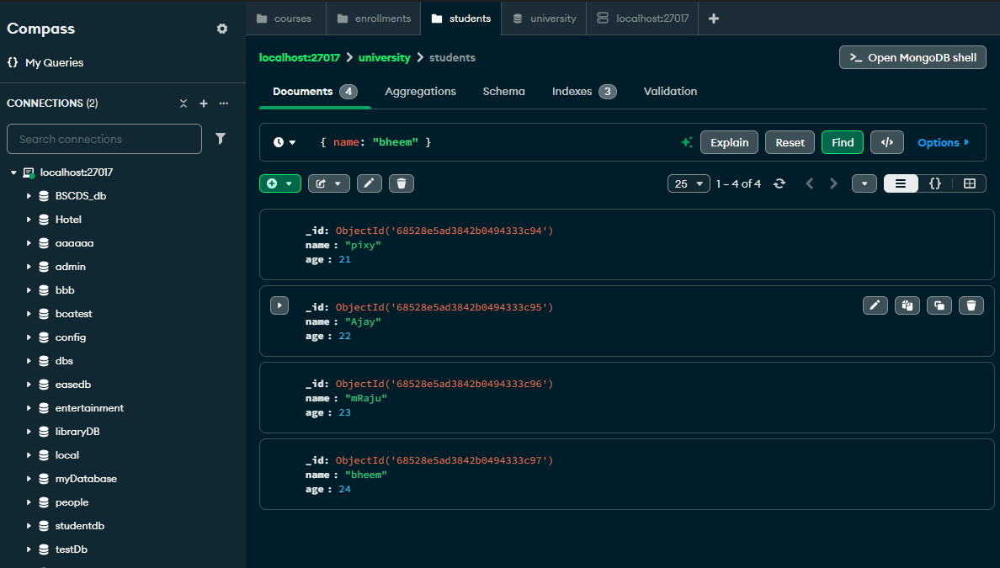
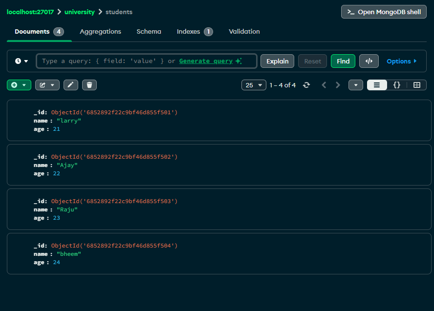
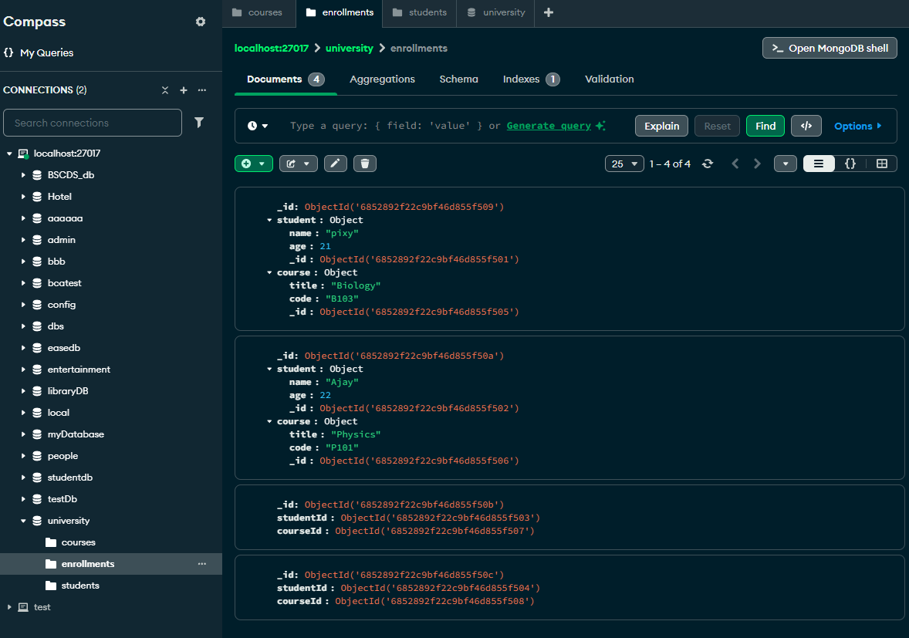
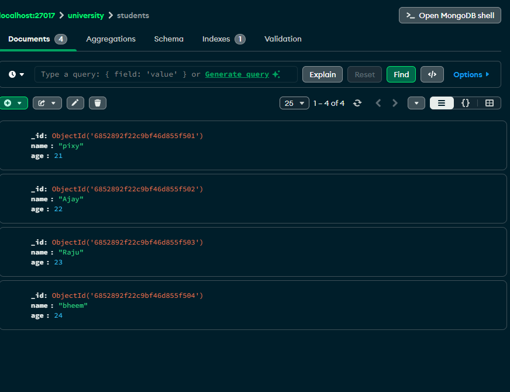
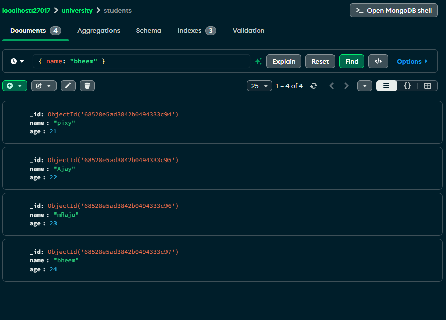
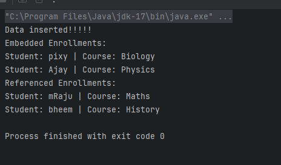

Task Day 3 - 23IOTA10
-
Created a Java application that manages student enrollments in courses using MongoDB.
Use embedded documents for some data and referenced documents for others, to understand their structural differences.
Uploaded the code to GitHub with the name Day3-Task

**Requirements**
-

**MongoDB Collections**
1. students — stores student details[**Done**]
2. courses — stores course details[**Done**]
3. enrollments — stores enrollment records[**Done**]

**Document Structure In enrollments**:
1. One document should embed both student and course data.
2. Another should reference them using ObjectIds.

**Done:**
1. Inserted sample students and courses.
2. Added two types of enrollments (embedded and referenced).
3. Queried and printed both types with full details.
4. Updated a student's name and mention the difference between updating a referenced document compared to embedded.
5. Created indexes for querying the students

Classes Explanation:
=

- Student.java: This class maps the collection student for the mongodb collection
- Course.java:  Same as student.java but for the collection named courses.
- enrollemb.java :responsible for making the relation between student and course in embedded way(similar to sql join but everything is copied to the same row).
- enrollref.java :responsible for making relation between student and course(like primary any forein key relation but in one table).
- mongoconnection: used to establish connection to database
- enrollmanager:the main program 

**Note:** Pixy and Ajay are stored using **embedded documents**, while Raju and Bheem are stored using **referenced documents**.

Attached images:
=
Collection that are made

-pixy is changed to "larry" in the student document

-but in enrollment collection the name is still "Pixy" this is beacause Embedded does not stay consistent

-raju is changed to mraju in the student document

-Printed Query+updated raju to mraju 

